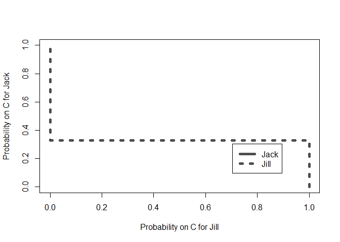
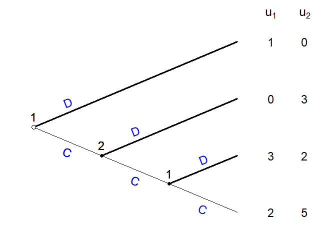
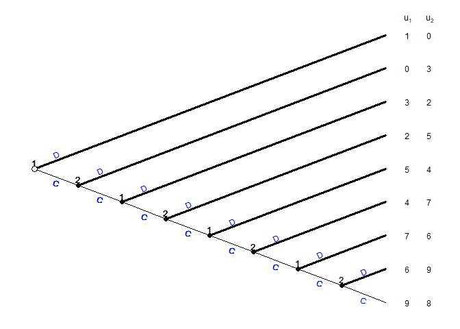

---
output:
  html_document:
    highlight: tango
    theme: cerulean
    keep_md: yes
---
# Games {.tabset .tabset-fade .tabset-pills}

Most of the items in *Political Games* look at either  "normal form games" (or "games in strategic form") or "extensive form games." Normal form games are games in which you specify three things:  i) a set of players, ii) actions available for each, and iii) preferences over outcomes. Extensive form games add a temporal dimension which lets you model important strategic features like credibiity and time consistency. 

In the ``hop`` package there are a suite a functions to model both types of game.

Simple normal form games can be illustrated nicely with payoff matrices --- figures that represent these three items in a direct way. The payoff matrices in the book are all generated using a simple R function `gt_bimatrix` from the  ```hop``` R package that takes a matrix of numbers as input and spits out a nice looking payoff matrix, indicating the pure strategy Nash equilibriums to boot. 

A few other functions in the package can be used to examine the strategic logic of these games. 

* With ``br_graph`` You can plot the utility of differet actions given probabilisic actions by opponents and plot best response functions in probability space. 
* With ``gt_brcplot`` you can do the same thing for a continuous action space and identify equilibrium sets
* With `gt_coase` or `gt_nbs` you can plot the bargaining possibilities induced by a normal form game, and figure out the possible bargaining outcomes under the assumption of transferable utility. 

For extensive form games the key function is ``gt_tree`` which can be used to plot game trees and find solutions to simple games. 

Follow the buttons below for more.


## Getting Going   
First open R or Rstudio and install the hop package from github (you will need to have devtools installed to do this, so perhaps you will need to `install.packages("devtools")`):


```r
devtools::install_github("macartan/hop")
```

Then load it up:

```r
library(hop)
```

## Payoff matrices 
The ```gt_bimatrix``` takes a payoff matrix and turns it into a nice figure. It can also mark best response functions as arrows and mark the (pure strategy) equilibriums as a star.

### Games with two players and two strategy options
The most basic games have just two strategy options for each player. 

The prisoner's dilemma matrix for example looks like this:

```r
PD <- matrix(c(2,4,1,3),2,2)
```

Once defined you can plot it like this:


```r
gt_bimatrix(PD, nash = FALSE, arrow1 = FALSE,  tscale = .75)
```


And make it nicer like this:


```r
gt_bimatrix(PD, nash = FALSE, arrow1 = FALSE, P1 = "Jack", P2 = "Jill",  labels1=c("Cooperate","Defect"), srt1=90, tscale = .5)
```


Or go for a more conservative style using various options like this:


```r
gt_bimatrix(matrix(c(1,0,0,0), 2, 2),
            labels1 = c("U","D"), labels2 = c("L","R"), 
            pty = "m", matrixfill=NULL, nash = FALSE, arrow1= FALSE, 
            asp = .45, tfont = "serif", tscale = .7)
```


            
You can also add in best response arrows that show the incentives to change strategies;  like this:


```r
gt_bimatrix(PD, nash = FALSE, arrow1 = TRUE, P1 = "Jack", P2 = "Jill",  labels1=c("Cooperate","Defect"), srt1=90, tscale = .5)
```


And add in a star to mark the Nash equilibria:


```r
gt_bimatrix(PD, P1 = "Jack", P2 = "Jill",  labels1=c("Cooperate","Defect"), srt1=90, tscale = .5)
```


Here is a comparison of a set of classic games:


```r
par(mfrow=c(2,2))
gt_bimatrix(X = matrix(c(2,4,1,3),2,2), tscale = .4, width1 = 1, alength = .15, main = "PD")
gt_bimatrix(X = matrix(c(3,4,2,1),2,2), tscale = .4, width1 = 1, alength = .15, , main = "Chicken")
gt_bimatrix(X = matrix(c(4,2,1,3),2,2), tscale = .4, width1 = 1, alength = .15, , main = "Assurance")
gt_bimatrix(X = matrix(c(1,4,3,2),2,2), Y = matrix(c(2,3,4,1),2,2), 
            tscale = .4, width1 = 1, alength = .15, ,  labels1 = c("Boxing", "Ballet"), srt1=90, 
            main = "Battle of the Sexes")
```


### Two players but multiple strategies
Extending to games with multiple actions for two players is straightforward and there
is no requirement that both players have the same options available to them. (Increasing the number of players is  trickier than increasing the number of options)

In this example Jill has five options and Jack has just two. PLot the payoff matrix and you see that there are two pure strategy Nash equilibria.


```r
Jack <- matrix(10*c(1:10) - (1:10)^2,2)
Jill <- matrix(10*c(1:10) - (1:10)^2,2)
gt_bimatrix(X=Jack, Y=Jill, P1 = "Jack", P2 = "Jill",  tscale = .5, width1 = 1.5, alength = .15, )
```


## Best responses
Many of the canonical games also have mixed strategy equilibria. Thes ecan be identified by looking at the payoffs to different actions conditional on different probabilities with which your opponent plays their strategies. 

Lets illustrate with the chicken game. First here is the payoff matrix:

```r
Chicken <- matrix(c(3,5,2,1),2,2)
gt_bimatrix(Chicken, P1 = "Jack", P2 = "Jill", labels1 = c("C","D"), tscale = .75)
```


Note that this particular game of chicken has joint gains maximized when only one side cooperates. 

We can also represent the utilities for both players as a function of the probability with which Jack plays "C":

```r
par(mfrow = c(2,1))
gt_brgraph(Chicken, P1 = "Jack", P2 = "Jill", br = FALSE, util = TRUE, u1 = FALSE)
gt_brgraph(Chicken, P1 = "Jack", P2 = "Jill", br = FALSE, util = TRUE, u2 = FALSE)
```


You can highlight Jill's best responses to any action by Jack like this:


```r
gt_brgraph(Chicken, P1 = "Jack", P2 = "Jill", br = FALSE, util = TRUE, cthighlight = TRUE, u1 = FALSE)
```


From that figure you can also see which action by Jack makes Jill indifferent between her two strategies. Another way to show the best responses is to define the sapce of the graph to be the actions by both players, then you can plot the optimal action by Jill as a function of Jack's actions directly. This is done using the same function but turning off the ``utilities`` switch and turning on the ``br`` (best responses) switch: 


```r
gt_brgraph(Chicken,  P1 = "Jack", P2 = "Jill", br = TRUE, util = FALSE, draw2 = FALSE)
```


You can do the same for Jack:

```r
gt_brgraph(Chicken,  P1 = "Jack", P2 = "Jill", br = TRUE, util = FALSE, draw1 = FALSE)
```

<!-- -->

And then the intersection is the Nash equilibrium.

```r
gt_brgraph(Chicken, P1 = "Jack", P2 = "Jill",  br = TRUE, util = FALSE)
```


## Continuous spaces
The same basic principle applies to games in which people have a continuum of strategies. Here is an example of a second 
prince sealed bid acution. Anyone can bid between 0 and 400 and each person ends up with the value of the object (if they get it) less the pricec they pay (if they pay). Under the rules the highest bidder wins but pays the price of the second highest bidder. Dun values tehgood at 200 and Dee at 400. The `gt_brcplot` function graphs the best responses (most of the arguments below are for formatting).


```r
u1=function(a1,a2){(400-a2)*(a1>a2)+(1/2)*(400-a2)*(a1==a2)+0*(a1<a2)}
u2=function(a1,a2){(200-a1)*(a2>a1)+(1/2)*(200-a1)*(a1==a2)+0*(a2<a1)}
gt_brcplot(u1=u1, u2=u2, player = 3, type="br", 
  n.grid = 21,  s1=0,s2=1000, 
  colbg1br = "white", brcex1=3.5, 
  colbg2br = "red",   brcex2=1.5,     
  xlab=paste("Dee's bid"), ylab=paste("Dum's bid"))
```


Here the solid dots are Dum's reactions to Dee's bid. The hollow dots are Dee's reactions to Dum's bid. The points with a solid dot inside the hollow dot are all points in which both player's best responses to an ation are the action itself -- in other words these are all nash equilibria.  

The same function can represent continuous game in other ways such as using contour plots or surface plots. THe figure below shows continuous reactions to the Dixit-Londregan game described in *Political Games*. 


```r
u1=function(a1,a2){.5+.3*a1/(a1+a2)+.15*(1-a1)/(2-a1-a2)}
u2=function(a1,a2){.5+.3*a2/(a1+a2)+.15*(1-a2)/(2-a1-a2)}
gt_brcplot(u1=u1, u2=u2, player = 3, type="br", cont = TRUE,
          n.grid = 400, brtype="l", clevels=10, brlwd=2,
          tol=.0000005, col1br = "red", 
          col2br = "black", col1="grey", starfill="red",
          xlab="Action by party 1",   ylab = "Action by party 2")
```


## Minimax illustration
Here is an example of a zero sum game like that described in appendix A2. 


```r
cat_and_mouse <- matrix(-c(0, 1, .75, .25),2)
gt_bimatrix(X = cat_and_mouse, Y = -cat_and_mouse, P1 = "Jill", P2 = "Jack",  labels1 = c("L", "R"))
```


This figure shows the best responses. 
In the figure I highlight the minimax strategies and the maximin strategies. You can see that these produce the same results.


```r
gt_brgraph (X = cat_and_mouse, Y = -cat_and_mouse, P1 = "Jill", P2 = "Jack", labels1 = c("L", "R"),  
            br = TRUE, util = TRUE, vert = FALSE)
```


The grey shaded segments in the left figure shows the best that Jack can get in response to any strategy by Jill. The lowest point in this section is the lowest Jill can impose on Jack given his best response to maximize his utility. 
The right figure shows what Jack gets when Jill responds to  his strategy by choosing the worst thing for him. The highest point on the shaded section is the least bad thing he can guarantee himself. Jack's utility is the same in both cases.


```r
par(mfrow = c(1,2))
gt_brgraph (X = cat_and_mouse, Y = -cat_and_mouse, P1 = "Jill", P2 = "Jack", labels1 = c("L", "R"),  
            br = FALSE, util = TRUE,            
            ur = FALSE, cthighlight=TRUE)
gt_brgraph (X = cat_and_mouse, Y = -cat_and_mouse, P1 = "Jill", P2 = "Jack", labels1 = c("L", "R"),  
            br = FALSE, util = TRUE,            
            uc = FALSE, rbhighlight=TRUE, overrow = FALSE)
```


## Getting Cooperative
One can also think of normal form games as generators of cooperative games. First it's useful to identify the minimax payoffs for players. This can be done using `gt_minimax`. For example:

```r
gt_minimax(Chicken)
```

```
## $`Minimax payoff`
## [1] 2
## 
## $`Other's strategy`
## [1] 0 1
```
The minimax payoff for each player in this game of Chicken is 2. This is gotten when the other player puts 100\% probability on the $D$ strategy. You cannot guarantee yourself more than 2 since if you tried playing D at all the other person could force you into accepting the all defect payoff with some probability. 

You can plot the utilities that can be achieved from pure strategies from a game like this just as a set of points. This would look like this:


```r
plot(Chicken, t(Chicken), xlab = "1's payoff", ylab = "2's payoff", pch=19)
```


A much bigger set of outcomes can be achieved through repeat play. Here the range of possible equilibrium payoffs are all those vectors that are both better than the status quo and  feasible, see as an intersection of polygons below:


```r
gt_folk(X = Chicken)
```


Cooperative solutions seek to find ways to choose among these payoffs or find compromises in the space between them but also, often, limit consideration to efficient outcomes and extend the possibilities to the set of payoffs that can be achieved through side payments (ie with utility transfers). 

The set of bargains given transferable utility and assuming people want to do better than minimax, is shown as the highlighted downward sloping border below:


```r
gt_coase(X=Chicken, bargain = TRUE, mar= NULL, col2 = "grey")
```


Finally one could  imagine specific bargaining solutions, such as the Nash bargaining solution. Shown here in terms of surplus over and above the breakdown (minimax) utility. Note the minimax utility is not necessarily a good default for bargaining since it might not be possible that both players receive the minimax simultaneously; they would need to be independently and irrationally pessimistic. 

```r
gt_nbs(matrix  = TRUE, X = Chicken, solution_only = TRUE, SQ = NULL, at = NULL)
```


## Game trees

The ```gt_tree``` function graphs game trees given a full specification of an extensive form game with complete information. To define an extensive form game we need to define:

* $H$: a set of histories -- that is all the possible paths that can be followed
* $P$: a player function that says what player moves at what point in each history
* $U$: Utilities awarded to players at the end of each history

### Illustration 1: Sequential Chicken

Here is a simple example. Lets imagine a Chicken game played out over time. H, P and U, are defined as follows:


```r
H <- matrix(c("0", "0", "0", "0", "C", "C", "D", "D", "C", "D",  "C", "D"),4)
P <- matrix(c(rep(1,4), rep(2,4)),4)
U <- matrix(c(1,0,2,-1,1,2, 0, -1), 4)
```

Then the game tree looks like this:
  

```r
gt_tree(H,U,P, title = "Sequential Chicken", solution = TRUE)
```


Note that `gt_tree` interprets the set of histories as a tree; it figures out the branches based on when the histories depart from each other and the nodes from the player function. The underlying data looks like this: 

History:

```r
rownames(H) <- c("H1", "H2", "H3", "H4")
kable(H, col.names = c("T0", "T1", "T2"))
```

     T0   T1   T2 
---  ---  ---  ---
H1   0    C    C  
H2   0    C    D  
H3   0    D    C  
H4   0    D    D  

Player Function:

```r
rownames(P) <- c("H1", "H2", "H3", "H4")
kable(P, col.names = c("T1", "T2"))
```

      T1   T2
---  ---  ---
H1     1    2
H2     1    2
H3     1    2
H4     1    2

Utilities:

```r
rownames(U) <- c("H1", "H2", "H3", "H4")
kable(U, col.names =c("U1", "U2"))
```

      U1   U2
---  ---  ---
H1     1    1
H2     0    2
H3     2    0
H4    -1   -1

### Illustration 2: The Hostage Game

The introductory text describes a hostage game in which options depend on past history.

Here is the graph with the solution:

```r
gt_tree(
      H = matrix(c("Take hostages", "Take hostages", "Don't take", "Pay Ransom", "Don't pay", ""),3),
      U = matrix(c(1,-1,0,-1,-2,0), 3),
      P = matrix(c(rep(1,3), c(2,2,1)),3),
      solution=TRUE, 
      player.names=c("Militants", "Gov")
      )
```

```
## [1] "Initial history column added"
```

<!-- -->

### More complex games
The function can allow much more complex games; the key chllenge is to be able to write out all the histories. Somestimes these histories can be generated in an automated way to make families of more complex games. 


```r
centipede <- function(n, ...){
		H <- matrix("C", n+1, n+1)
		H[lower.tri(H)] <- "D"
		H <- H[,n:1]
		U <- cbind(U1 = ((n+1):1) + 2*((n+1):1)%%2 - 2,
		          U2 = ((n+1):1) - 2*((n+1):1)%%2 + 1)
		P <-  t(replicate(n+1, rev(rep(1:2, length = n+1))))
		P[lower.tri(P)] <- t(P)[lower.tri(P)]
		P <- t(P)[,(n+1):1]
		gt_tree(H,U,P, ...)
		}
```

Now use this to graph a short and a long centipede game: 

```r
centipede(n = 3, solution = TRUE)		
```

```
## [1] "Initial history column added"
```

<!-- -->

```r
centipede(n = 8, solution = TRUE, textsize=.75)		
```

```
## [1] "Initial history column added"
```

<!-- -->

### Adding and forcing solutions
You can add or remove solutions using the solution argument. The sequential chicken without a solution is drawn like this:


```r
gt_tree(H,U,P, title = "Sequential Chicken", solution = FALSE)
```


The solution will however generally not appear for a non-generic game:


```r
U[1,2] <- 0
gt_tree(H,U,P, title = "Non-generic", solution = TRUE)
```

```
## [1] "Game is not generic and solution not attempted."
```


Unless forced:

```r
gt_tree(H,U,P, title = "Non-generic", solution = TRUE, force_solution = TRUE)
```

```
## [1] "Warning: Solution attempted even though game is not generic"
```


This can however have undesireable consequences:

```r
U[1,2] <- 2
gt_tree(H,U,P, title = "Non-generic", solution = TRUE, force_solution = TRUE)
```

```
## [1] "Warning: Solution attempted even though game is not generic"
```


### Formatting
You can do a reasonable amount of formatting in terms of specifying sizes and colors. eg: 

```r
gt_tree(H,U,P, 
  title = "Sequential Chicken",
  force_solution = TRUE,
  player.names=c("Jack", "Jill"),
  textsize  = 1,
  titlesize = 2,
  utextsize = 1.25,
  btextsize = 1.5,
  slopetext = FALSE,

  branchcol = "orange",
  actioncol = "black",
  titlecol  = "grey",
  playercol = "red",
  solutioncol = "darkorange"
        )
```

```
## [1] "Warning: Solution attempted even though game is not generic"
```


### Limitations
Besides being in alpha stage the main limitations of this function the fact that it cannot solve when there are multiple equilibria and payoff indifferences; and it cannot solve games of incomplete information. Even still it can be used to graph these and then then information sets and solutions can be superimposed.  

